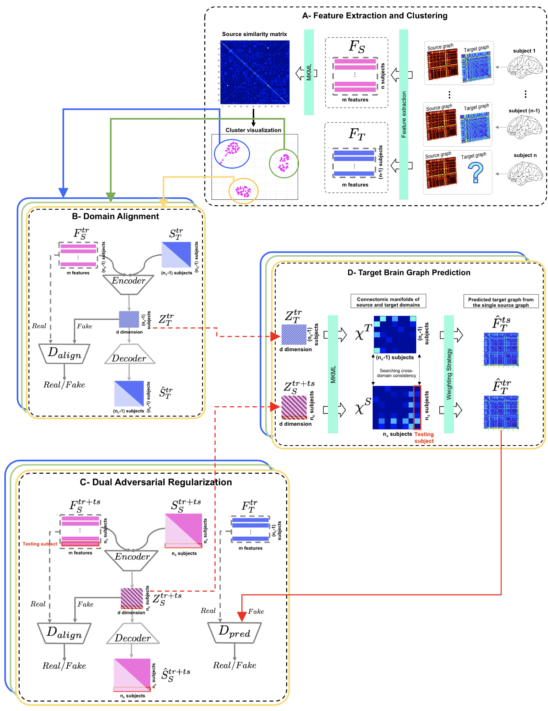

# LG-DADA
LG-DADA for predicting a target brain graph from a source brain graph, coded up in Python by Alaa Bessadok. Please contact alaa.bessadok@gmail.Com for further inquiries. Thanks. 

This repository provides the official Tensorflow implementation of the following paper:

<p align="center">
  
</p>


> **Brain Graph Synthesis by Dual Adversarial Domain Alignment and Target Graph Prediction from a Source Graph**
> [Alaa Bessadok](https://github.com/AlaaBessadok)<sup>1,2</sup>, [Mohamed Ali Mahjoub]<sup>2</sup>, [Islem Rekik](https://basira-lab.com/)<sup>1</sup>
> <sup>1</sup>BASIRA Lab, Faculty of Computer and Informatics, Istanbul Technical University, Istanbul, Turkey
> <sup>2</sup>University of Sousse, Higher Institute of Informatics and Communication Technologies, Sousse, Tunisia
>
> **Abstract:** *Developing predictive intelligence in neuroscience for learning how to generate multimodality medical data from a single modality can improve neurological disorder diagnosis with minimal data acquisition resources. Existing deep learning frameworks are mainly tailored for images, which might fail in handling geometric data (e.g., brain graphs). Specifically, predicting a target brain graph from a single source brain graph remains largely unexplored. Solving such problem is generally challenged with domain fracture caused by the difference in distribution between source and target domains. Besides, solving the prediction and domain fracture independently might not be optimal for both tasks. To address these challenges, we unprecedentedly propose a Learning-guided Graph Dual Adversarial Domain Alignment (LG- DADA) framework for predicting a target brain graph from a source brain graph. The proposed LG-DADA is grounded in three fundamental contributions: (1) a source data pre-clustering step using manifold learning to firstly handle source data heterogeneity and secondly circumvent mode collapse in generative adversarial learning, (2) a domain alignment of source domain to the target domain by adversarially learning their latent representations, and (3) a dual adversarial regularization that jointly learns a source embedding of training and testing brain graphs using two discriminators and predict the training target graphs. Results on morphological brain graphs synthesis showed that our method produces better prediction accuracy and visual quality as compared to other graph synthesis methods.*

This work is published in Medical Image Analysis Journal 2020. LG-DADA is a geometric deep learning framework for for target brain graph prediction from a single source graph. It comprises four key steps (1) feature extraction and clustering, (2) adversarial domain alignment, (3) dual adversarial regularization and (4) target brain graph prediction. We have evaluated our method on ABIDE dataset. Detailed information can be found in the original paper. In this repository, we release the code for training and testing LG-DADA on a simulated dataset.

# Libraries to install

The code has been tested on a computer having Ubuntu 16.04 and GPU is not required to run the code. You also need to install dependencies:

* [Python >= 2.7](https://www.python.org)
* [Anaconda 2-5.3.0](https://www.anaconda.com/products/individual)
* [TensorFlow 1.5](https://www.tensorflow.org/?hl=fr)
* [Numpy >= 1.8](https://numpy.org/)
* [scikit-learn >= 0.17](https://scikit-learn.org/stable/)
* [Scipy >= 0.13.2](https://www.scipy.org/)
* [SIMLR](https://github.com/bowang87/SIMLR_PY)

# Run from Jupyter Notebook

We provide a demo code for the usage of LG-DADA for target graph prediction from a source graph. In demo.py we train and test LG-DADA on a simulated dataset with 150 subjects. You can run the program on Jupyter Notebook with the following command:

```bash
run demo.py
```

# Input and Output data

In order to use our framework, you need to provide a sourceGraph and a targetGraph matrices, each of size (n * m). We denote n the total number of subjects in the dataset and m the number of features. You need to include your data in the file demo.py by removing our simulated dataset and replace it with yours. By default, the number of clusters is set to 2 you can change it in the same file demo.py by updating the parameter (```c = 2 ```). Our code is generic and can be used for any type of isomorphic graph. It mainly output a target graph from a source graph (see figure below). 

<p align="center">
  
</p>

# Related references

Adversarially Regularized Graph Autoencoder (ARGA):
Pan, S., Hu, R., Long, G., Jiang, J., Yao, L., Zhang, C.: Adversarially regularized graph autoencoder. [https://arxiv.org/abs/1802.04407] (2018) [https://github.com/Ruiqi-Hu/ARGA].

Single‐cell Interpretation via Multi‐kernel LeaRning (SIMLR):
Wang, B., Ramazzotti, D., De Sano, L., Zhu, J., Pierson, E., Batzoglou, S.: SIMLR: a tool for large-scale single-cell analysis by multi-kernel learning. [https://www.biorxiv.org/content/10.1101/052225v3] (2017) [https://github.com/bowang87/SIMLR_PY].
# Citation

If our code is useful for your work please cite our paper:

```latex
@article{bessadok2020brain,
  title={Brain Graph Synthesis by Dual Adversarial Domain Alignment and Target Graph Prediction from a Source Graph},
  author={Bessadok, Alaa and Mahjoub, Mohamed Ali and Rekik, Islem},
  journal={Medical Image Analysis},
  pages={101902},
  year={2020},
  publisher={Elsevier}
}
```

# Acknowledgement

This project has been funded by the 2232 International Fellowship for Outstanding Researchers Program of TUBITAK (Project No:118C288, http://basira-lab.com/reprime/) supporting Dr. Islem Rekik. However, all scientific contributions made in this project are owned and approved solely by the authors.

# License
Our code is released under MIT License (see LICENSE file for details).


